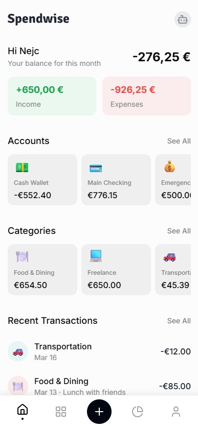

# Spendwise

> ⚠️ Work in progress!

Spendwise is a personal finance app built with Expo and React Native. The app is local-first: core financial data lives in on-device SQLite and user preferences live in MMKV.



## What the app includes

- Onboarding and profile/preferences setup
- Accounts, categories, and transactions
- Stats, insights, and trend views
- Budgets and savings goals
- CSV import flow
- Currency rates and formatting preferences
- Local notifications for finance reminders
- Optional app lock / biometric protection
- Optional AI assistant backed by user-provided API keys

## Stack

- Expo SDK 54 with React Native 0.81
- Expo Router 6 for file-based navigation
- SQLite for primary app data
- Zustand + MMKV for persisted preferences and lightweight app state
- React Query for async queries/mutations over local data and network tasks
- TanStack Form + Zod for forms and validation
- Uniwind for styling
- Jest + React Native Testing Library + Maestro

## Quick Start

### Requirements

- Node.js 20+
- `pnpm`
- Expo / EAS tooling as needed for device builds

### Install

```bash
pnpm install
```

### Configure environment

Copy `.env.example` to `.env` and adjust values for your machine.

```bash
cp .env.example .env
```

On Windows PowerShell, use:

```powershell
Copy-Item .env.example .env
```

At minimum, the current env schema expects:

- `EXPO_PUBLIC_APP_ENV`
- `EXPO_PUBLIC_API_URL`
- `EXPO_PUBLIC_VAR_NUMBER`
- `EXPO_PUBLIC_VAR_BOOL`
- `APP_BUILD_ONLY_VAR` (optional)

If `EXPO_PUBLIC_ASSOCIATED_DOMAIN` is not used, omit it entirely instead of leaving it blank.

`EXPO_PUBLIC_NAME`, `EXPO_PUBLIC_SCHEME`, `EXPO_PUBLIC_BUNDLE_ID`, `EXPO_PUBLIC_PACKAGE`, and `EXPO_PUBLIC_VERSION` are derived in `env.ts`.

### Run locally

```bash
pnpm start
pnpm ios
pnpm android
pnpm web
```

## Common Commands

```bash
pnpm lint
pnpm lint:ts
pnpm lint:all
pnpm test
pnpm test:watch
pnpm test:ci
pnpm verify
pnpm install-maestro
pnpm e2e-test
pnpm doctor
pnpm knip
```

`pnpm e2e-test` currently targets the development app id and assumes Maestro is installed.
`pnpm install-maestro` uses a shell installer and may need a Bash-compatible environment.

## Environment Modes

- `development`: local dev and internal development builds
- `preview`: pre-release QA / preview builds
- `production`: store-ready production builds

Helpers:

```bash
pnpm start:preview
pnpm start:production
pnpm ios:preview
pnpm ios:production
pnpm android:preview
pnpm android:production
```

## Architecture At A Glance

- `src/app`: Expo Router entry points and route files
- `src/features`: feature-first modules such as accounts, transactions, stats, insights, budgets, goals, imports, settings, notifications, and security
- `src/components`: shared app components and UI primitives
- `src/lib`: infrastructure for SQLite, storage, theming, i18n, utilities, and app-wide providers
- `src/translations`: translation resources

App startup happens in `src/app/_layout.tsx`, where the app initializes SQLite, runs migrations, sets up notifications, checks budget/upcoming-bill alerts, and mounts global providers.

## Privacy Notes

- Financial records are stored locally in SQLite on the device.
- Preferences and lightweight persisted state are stored in MMKV.
- AI provider keys are configured in-app and stored locally in persisted state.
- AI requests are sent directly from the client to the selected provider.

## Documentation

- `.docs/setup.md`
- `.docs/architecture.md`
- `.docs/features.md`
- `.docs/testing.md`
- `.docs/release.md`
- `AGENTS.md`

## Inspiration

> This Project is based on [Obytes starter](https://starter.obytes.com)

- [PocketGuard](https://pocketguard.com/)
- [Wallet / BudgetBakers](https://budgetbakers.com/en/)


## Resources

- Avatars: https://www.figma.com/design/LcTCGVae3fI72lJASdNtHn/Playful-Avatar-Creator---DrawKit--Community-?node-id=3-3&p=f&t=FrbHnCBsjZzFhIHh-0

## Roadmap

High-level roadmap (subject to change):

### Money & currency

- [ ] Improve currency support (rates + consistent formatting, including default currency)

### Budgets

- [ ] Support global budgets and per-category budgets (monthly and yearly)

### Recurring transactions

- [ ] Allow making existing transactions repeatable (recurring rules)

### AI features

- [ ] Recommendations and chat
- [ ] Insights

### Product polish

- [ ] Improve overall UI/UX across the app
  - [ ] Clear feedback for actions (toasts, errors, confirmations, etc.)
- [ ] Add richer transaction details (e.g. merchant)

### Quality & release

- [ ] Expand test coverage (including Android)
- [ ] Prepare and publish store app releases
